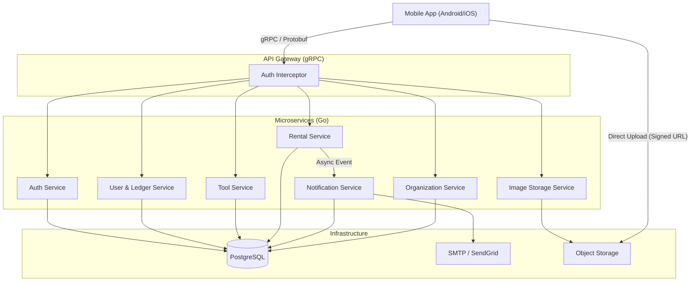

# Architecture Design - Trusted Group Backend

## 1. Overview

This architecture supports the Trusted Group (Church) tool-sharing platform. It is a simplified, mobile-first microservice architecture built with **Go (Golang)** and **gRPC**, utilizing **PostgreSQL** as the single source of truth.

## 2. High-Level Diagram

## 3. Technology Stack

- **Language:** Go (Golang) 1.21+
- **Communication:** gRPC (Protocol Buffers v3)
- **Database:** PostgreSQL 15+

- **Internal Messaging:** Go Channels (for simple async) or lightweight Queue (Redis/Bull) if scale needed. MVP uses synchronous or goroutine-based async.

## 4. Service Breakdown

### 4.1 Auth Service (`pkg/auth`)
- **Responsibilities:**
    - Verify Invitation Tokens.
    - User Registration/Login.
    - JWT Token Generation & Validation.
    - Handle "Request to Join" workflow.
- **Data:** `users` table (auth fields), `invitations` table (linked to `orgs`).

### 4.2 User & Ledger Service (`pkg/user`, `pkg/ledger`)
- **Responsibilities:**
    - Manage user profile.
    - **Ledger:** Manage Credits/Debits.
    - **Transactions:** Log every billing event (scoped by `org_id`).
    - Admin override for balances.
- **Data:** `users` (profile fields), `ledger_transactions`, `orgs`, `users_orgs`.

### 4.3 Tool Service (`pkg/tool`)
- **Responsibilities:**
    - CRUD for Tools.
    - **Search:** List-based filtering (Condition, Price type, Category).
    - Image association.
- **Data:** `tools`, `tool_images`, `categories` tables.

### 4.4 Rental Service (`pkg/rental`)
- **Responsibilities:**
    - Request lifecycle: Request -> Owner Confirm -> Rental Active -> Return -> Complete.
    - **Overdue Check:** Daily cron to check `end_date < now` and status != `Returned`.
    - Trigger Ledger updates on Completion.
- **Data:** `rentals` table.

### 4.5 Notification Service (`pkg/notification`)
- **Responsibilities:**
    - Send Emails (Invite, status updates, overdue reminders).
    - Persist In-App alerts for fetching by client (`GetNotifications`, `MarkRead`).
- **Data:** `notifications` table.

### 4.6 Organization Service (`pkg/org`)
- **Responsibilities:**
    - Manage Organization profiles (Church A, Church B).
    - Handle Organization Metrics/Metro.
    - Mange User Memberships (`JoinOrg`, `ListUserOrgs`).
- **Data:** `orgs`, `users_orgs`.

## 5. Data Flow Examples

### 5.1 Join via Invitation
1.  Admin calls `CreateInvite(email)`. Service generates Token, emails User.
2.  User app sends `ValidateInvite(token)`. Service checks expiry/validity.
3.  User submits `Register(token, password, name)`.
4.  Service creates User, invalidates Token, returns JWT.

### 5.2 Rental Request & Ledger
1.  Renter calls `RequestRental(toolId, dates)`.
2.  Service creates Rental (Status: PENDING). Notifies Owner.
3.  Owner calls `RespondRental(rentalId, ACCEPT)`.
4.  Service updates Rental (Status: ACCEPTED). Notifies Renter.
5.  ... Time passes ...
6.  Owner calls `CompleteRental(rentalId)`.
7.  Service updates Status: COMPLETED.
8.  Service calls `Ledger.Transfer(Renter, Owner, Amount)`.

## 6. Security Considerations
- **Trust Model:** App is strictly invite-only. High trust environment, but auth is still rigid.
- **Tokens:** Short-lived JWT Access Tokens, Longer Refresh Tokens.
- **Invite Tokens:** One-time use, 1 week expiry.
- **Transport:** TLS 1.3 required.
