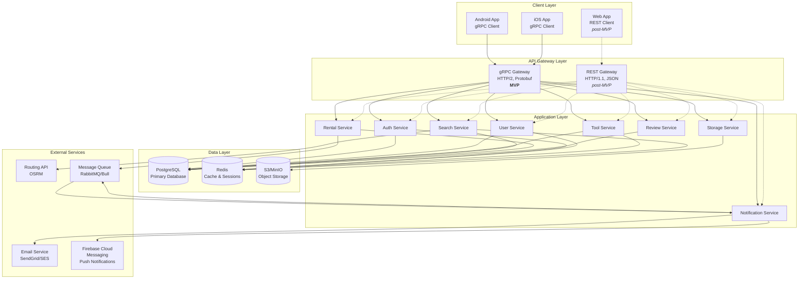

# Ubertool Backend Architecture Design

## 1. Architecture Overview

### 1.1 Architecture Pattern
**Layered Architecture** with clear separation of concerns and **Dual API Gateway**:
- **Presentation Layer:** 
  - **gRPC API** for mobile clients (Android, iOS) - Protocol Buffers, HTTP/2
  - **RESTful API** for web browsers (post-MVP) - JSON over HTTP/1.1
- **Business Logic Layer:** Services and domain logic (shared by both APIs)
- **Data Access Layer:** Repository pattern with ORM
- **Infrastructure Layer:** External services, caching, storage

**MVP Focus:** gRPC API for mobile platforms only. RESTful API for web will be added post-MVP.

### 1.2 Architecture Diagram



**Legend:**
- Solid lines: MVP implementation (gRPC for mobile)
- Dashed lines: Post-MVP (REST for web)

## 2. Service Breakdown

### 2.1 Authentication Service
**Responsibilities:**
- User registration and email verification
- Login/logout with JWT token generation
- Password reset workflow
- Token refresh mechanism
- Session management

**Key Components:**
- `AuthController`: API endpoints
- `AuthService`: Business logic
- `TokenManager`: JWT creation/validation
- `PasswordHasher`: bcrypt hashing
- `EmailVerifier`: Verification token management

**Dependencies:**
- PostgreSQL (users table)
- Redis (sessions, blacklisted tokens)
- Email Service (verification emails)

**gRPC Service Definition:**
```protobuf
service AuthService {
  rpc Register(RegisterRequest) returns (RegisterResponse);
  rpc Login(LoginRequest) returns (LoginResponse);
  rpc Logout(LogoutRequest) returns (LogoutResponse);
  rpc RefreshToken(RefreshTokenRequest) returns (RefreshTokenResponse);
  rpc ForgotPassword(ForgotPasswordRequest) returns (ForgotPasswordResponse);
  rpc ResetPassword(ResetPasswordRequest) returns (ResetPasswordResponse);
  rpc VerifyEmail(VerifyEmailRequest) returns (VerifyEmailResponse);
}
```

**RESTful API Endpoints (post-MVP):**
```
POST /api/v1/auth/register
POST /api/v1/auth/login
POST /api/v1/auth/logout
POST /api/v1/auth/refresh
POST /api/v1/auth/forgot-password
POST /api/v1/auth/reset-password
POST /api/v1/auth/verify-email
```

---

### 2.2 User Service
**Responsibilities:**
- User profile CRUD operations
- Profile photo management
- Address geocoding
- User verification status
- Privacy settings

**Key Components:**
- `UserController`: API endpoints
- `UserService`: Business logic
- `UserRepository`: Data access
- `GeocodingService`: Address to coordinates
- `ProfilePhotoManager`: Image handling

**Dependencies:**
- PostgreSQL (users table)
- Redis (user profile cache)
- Storage Service (profile photos)
- Nominatim (geocoding - OpenStreetMap)

**API Endpoints:**
```
GET    /api/v1/users/me
PUT    /api/v1/users/me
DELETE /api/v1/users/me
POST   /api/v1/users/me/photo
GET    /api/v1/users/:userId
GET    /api/v1/users/:userId/ratings
```

---

### 2.3 Tool Service
**Responsibilities:**
- Tool listing CRUD operations
- Multi-image upload and management
- Category management
- Availability calendar
- Tool status tracking

**Key Components:**
- `ToolController`: API endpoints
- `ToolService`: Business logic
- `ToolRepository`: Data access
- `ImageManager`: Multi-image handling
- `AvailabilityManager`: Calendar logic

**Dependencies:**
- PostgreSQL (tools, tool_images, categories tables)
- Redis (tool listing cache)
- Storage Service (tool images)

**API Endpoints:**
```
POST   /api/v1/tools
GET    /api/v1/tools/:toolId
PUT    /api/v1/tools/:toolId
DELETE /api/v1/tools/:toolId
GET    /api/v1/tools/my-listings
POST   /api/v1/tools/:toolId/images
DELETE /api/v1/tools/:toolId/images/:imageId
PUT    /api/v1/tools/:toolId/availability
GET    /api/v1/tools/:toolId/availability
```

---

### 2.4 Search Service
**Responsibilities:**
- Full-text search on tools
- Geospatial proximity queries
- Multi-criteria filtering
- Result sorting and pagination
- Search analytics

**Key Components:**
- `SearchController`: API endpoints
- `SearchService`: Business logic
- `SearchQueryBuilder`: Dynamic query construction
- `DistanceCalculator`: Haversine formula
- `SearchCache`: Result caching

**Dependencies:**
- PostgreSQL (tools table with indexes)
- Redis (search result cache)
- OSRM (distance calculations and routing)

**API Endpoints:**
```
GET /api/v1/search/tools
GET /api/v1/search/nearby
GET /api/v1/categories
```

**Database Indexes:**
- Full-text index on `tools.name` and `tools.description`
- Geospatial index on `tools.location` (PostGIS)
- B-tree indexes on `category_id`, `price`, `condition`, `created_at`

---

### 2.5 Rental Service
**Responsibilities:**
- Rental request workflow
- Request status management
- Finalization and cancellation logic
- Request history and audit trail
- Notification triggering

**Key Components:**
- `RentalController`: API endpoints
- `RentalService`: Business logic
- `RentalRepository`: Data access
- `RequestStateMachine`: Status transitions
- `ConflictDetector`: Overlapping date checks

**Dependencies:**
- PostgreSQL (rental_requests table)
- Message Queue (notification events)
- Notification Service (via queue)

**API Endpoints:**
```
POST   /api/v1/rentals/request
GET    /api/v1/rentals/requests/:requestId
PUT    /api/v1/rentals/requests/:requestId/accept
PUT    /api/v1/rentals/requests/:requestId/reject
PUT    /api/v1/rentals/requests/:requestId/finalize
PUT    /api/v1/rentals/requests/:requestId/cancel
GET    /api/v1/rentals/my-requests
GET    /api/v1/rentals/incoming-requests
GET    /api/v1/rentals/history
```

**State Machine:**
```
pending → accepted → finalized
pending → rejected
pending → cancelled
accepted → cancelled
```

---

### 2.6 Review Service
**Responsibilities:**
- Bidirectional rating and review system
- Review submission and validation
- Aggregate rating calculation
- 2-year rolling window enforcement
- Review moderation

**Key Components:**
- `ReviewController`: API endpoints
- `ReviewService`: Business logic
- `ReviewRepository`: Data access
- `RatingCalculator`: Aggregate rating logic
- `ReviewModerator`: Flag handling

**Dependencies:**
- PostgreSQL (reviews table)
- Message Queue (notification events)

**API Endpoints:**
```
POST   /api/v1/reviews
GET    /api/v1/reviews/:reviewId
PUT    /api/v1/reviews/:reviewId
DELETE /api/v1/reviews/:reviewId
GET    /api/v1/reviews/user/:userId
GET    /api/v1/reviews/tool/:toolId
POST   /api/v1/reviews/:reviewId/flag
```

**Business Rules:**
- Reviews only after rental finalization
- One review per rental per user
- Reviews older than 2 years excluded from aggregate
- Recalculate aggregate on new review

---

### 2.7 Notification Service
**Responsibilities:**
- Email notification delivery
- Push notifications (post-MVP)
- Notification preferences management
- Template rendering
- Delivery tracking and retry logic

**Key Components:**
- `NotificationController`: API endpoints
- `NotificationService`: Business logic
- `NotificationWorker`: Queue consumer
- `TemplateRenderer`: Email template engine
- `DeliveryTracker`: Status tracking

**Dependencies:**
- Message Queue (notification events)
- Email Service (SendGrid/SES)
- PostgreSQL (notifications, preferences tables)

**API Endpoints:**
```
GET    /api/v1/notifications
PUT    /api/v1/notifications/:notificationId/read
PUT    /api/v1/notifications/preferences
GET    /api/v1/notifications/preferences
```

**Notification Types:**
- New rental request
- Request accepted/rejected
- Request finalized/cancelled
- New review received
- Email verification
- Password reset

---

### 2.8 Storage Service
**Responsibilities:**
- Image upload with validation
- Multiple size generation (thumbnail, medium, full)
- Image optimization and compression
- CDN integration
- Secure signed URLs
- Image deletion and cleanup

**Key Components:**
- `StorageController`: API endpoints
- `StorageService`: Business logic
- `ImageProcessor`: Resize and optimize
- `S3Manager`: Object storage interface
- `CDNManager`: CloudFront integration

**Dependencies:**
- S3/MinIO (object storage)
- CDN (CloudFront or similar)

**Technical Specs:**
- Max file size: 5MB
- Supported formats: JPEG, PNG, WebP
- Generated sizes: 150x150 (thumb), 800x600 (medium), original
- Compression: 85% quality for JPEG

---

## 3. Data Flow Patterns

### 3.1 gRPC Request Flow (Mobile - MVP)
```
1. Mobile client sends gRPC request (Protocol Buffers over HTTP/2)
2. gRPC Gateway validates request (auth via JWT metadata, rate limit)
3. Request routed to appropriate service
4. Service validates business rules
5. Service checks cache (Redis)
   - Cache hit: Return cached data
   - Cache miss: Continue to database
6. Repository queries PostgreSQL
7. Service processes data
8. Service updates cache if needed
9. Service returns Protobuf response
10. gRPC Gateway sends response to mobile client
```

**Benefits of gRPC for Mobile:**
- **Smaller payload size:** Protocol Buffers are more compact than JSON
- **Faster serialization:** Binary format vs text-based JSON
- **HTTP/2 multiplexing:** Multiple requests over single connection
- **Bidirectional streaming:** Real-time updates (future feature)
- **Strong typing:** Auto-generated client code with type safety
- **Better mobile performance:** Lower battery consumption, faster responses

### 3.2 RESTful Request Flow (Web - Post-MVP)
```
1. Web client sends HTTP request (JSON over HTTP/1.1)
2. REST Gateway validates request (auth, rate limit, CORS)
3. Request routed to appropriate service
4. Service validates business rules
5. Service checks cache (Redis)
   - Cache hit: Return cached data
   - Cache miss: Continue to database
6. Repository queries PostgreSQL
7. Service processes data
8. Service updates cache if needed
9. Service returns JSON response
10. REST Gateway sends response to web client
```

### 3.3 Asynchronous Event Flow (Notifications)
```
1. Rental Service accepts request
2. Rental Service publishes event to queue
3. Notification Worker consumes event
4. Notification Service renders notification template
5. For mobile: Send push notification via Firebase Cloud Messaging
6. For email: Send email via SendGrid
7. Notification Service logs delivery status
8. Retry on failure (max 3 attempts)
```

### 3.4 Image Upload Flow (gRPC Streaming)
```
1. Mobile client requests signed upload URL via gRPC
2. Storage Service generates signed S3 URL
3. Client uploads directly to S3 (or uses gRPC streaming for smaller images)
4. Client notifies backend of upload completion via gRPC
5. Storage Service retrieves image from S3
6. Image Processor generates multiple sizes
7. Storage Service uploads processed images to S3
8. Storage Service updates database with image URLs
9. CDN caches images for fast delivery
10. gRPC response returns image URLs to client
```

**gRPC Streaming Option (for smaller images < 1MB):**
- Client streams image chunks via gRPC
- Server receives chunks and assembles image
- Eliminates need for direct S3 upload
- Simpler client implementation

## 4. Database Design Principles

### 4.1 Schema Design
- Normalized to 3NF to reduce redundancy
- Denormalization where performance critical (e.g., aggregate ratings)
- Soft deletes for data retention (deleted_at timestamp)
- Audit trails for critical entities (created_at, updated_at)
- Foreign key constraints for referential integrity

### 4.2 Indexing Strategy
- Primary keys (auto-incrementing integers)
- Foreign keys (for joins)
- Frequently queried fields (category_id, status, user_id)
- Full-text search indexes (name, description)
- Geospatial indexes (location coordinates)
- Composite indexes for common query patterns

### 4.3 Performance Optimization
- Connection pooling (min 10, max 100 connections)
- Read replicas for heavy read operations
- Partitioning for large tables (e.g., notifications by date)
- Materialized views for complex aggregations
- Query optimization and EXPLAIN analysis

## 5. Caching Strategy

### 5.1 Cache Layers
**Redis Cache:**
- User profiles (TTL: 1 hour)
- Tool listings (TTL: 30 minutes)
- Search results (TTL: 5 minutes)
- Session data (TTL: 7 days)
- Rate limit counters (TTL: 1 minute)

**CDN Cache:**
- Static assets (images, CSS, JS)
- Tool images (TTL: 24 hours)
- Profile photos (TTL: 24 hours)

### 5.2 Cache Invalidation
**Write-through:** Update cache on database write
**Cache-aside:** Lazy loading, populate on cache miss
**Time-based expiration:** TTL for all cached items
**Event-based invalidation:** Clear cache on specific events (e.g., tool update)

### 5.3 Cache Keys
```
user:{userId}
tool:{toolId}
search:{hash(query_params)}
session:{sessionId}
rate_limit:{userId}:{endpoint}
```

## 6. Security Architecture

### 6.1 Authentication & Authorization
**JWT Token Structure:**
```json
{
  "header": {
    "alg": "HS256",
    "typ": "JWT"
  },
  "payload": {
    "userId": 123,
    "email": "user@example.com",
    "role": "user",
    "iat": 1234567890,
    "exp": 1234568790
  }
}
```

**Authorization Middleware:**
- Verify JWT signature
- Check token expiration
- Validate user exists and is active
- Check user permissions for resource
- Inject user context into request

### 6.2 Data Security
- **Encryption at rest:** AES-256 for sensitive data
- **Encryption in transit:** TLS 1.3 for all connections
- **Password hashing:** bcrypt with 12 rounds
- **PII protection:** Anonymize for analytics
- **SQL injection prevention:** Parameterized queries via ORM
- **XSS prevention:** Input sanitization and output encoding

### 6.3 API Security
- **Rate limiting:** 100 req/min per user, 1000 req/min per IP
- **CORS:** Whitelist allowed origins
- **CSRF protection:** Token-based validation
- **Input validation:** Schema validation on all inputs
- **Output sanitization:** Remove sensitive fields from responses

### 6.4 Infrastructure Security
- **Secrets management:** Environment variables, AWS Secrets Manager
- **Network isolation:** VPC with private subnets for databases
- **Firewall rules:** Restrict access to necessary ports
- **DDoS protection:** CloudFlare or AWS Shield
- **Security headers:** HSTS, CSP, X-Frame-Options

## 7. Scalability Considerations

### 7.1 Horizontal Scaling
- **Stateless services:** No server-side session state
- **Load balancing:** Round-robin or least connections
- **Auto-scaling:** Based on CPU/memory metrics
- **Database read replicas:** Distribute read load
- **Sharding:** Partition data by geographic region (future)

### 7.2 Vertical Scaling
- **Database:** Increase CPU, RAM, storage
- **Cache:** Increase Redis memory
- **Application servers:** Increase instance size

### 7.3 Bottleneck Mitigation
- **Database:** Connection pooling, query optimization, indexes
- **API:** Rate limiting, caching, async processing
- **Storage:** CDN for images, compression
- **Queue:** Multiple workers for notification processing

## 8. Monitoring & Observability

### 8.1 Metrics Collection
**Application Metrics:**
- Request rate, latency (p50, p95, p99)
- Error rate by endpoint
- Database query time
- Cache hit/miss rate
- Queue depth and processing time

**Infrastructure Metrics:**
- CPU, memory, disk usage
- Network throughput
- Database connection pool stats
- Redis memory usage

**Business Metrics:**
- User registrations
- Tools listed
- Rental requests created
- Request acceptance rate
- Review submission rate

### 8.2 Logging
**Structured Logging (JSON):**
```json
{
  "timestamp": "2026-01-11T17:42:05Z",
  "level": "INFO",
  "service": "rental-service",
  "requestId": "req_abc123",
  "userId": 456,
  "message": "Rental request created",
  "metadata": {
    "toolId": 789,
    "requestId": 101112
  }
}
```

**Log Levels:**
- DEBUG: Detailed diagnostic info
- INFO: General informational messages
- WARN: Warning messages (non-critical issues)
- ERROR: Error messages (failures)

**Centralized Logging:**
- ELK Stack (Elasticsearch, Logstash, Kibana)
- Or Loki + Grafana

### 8.3 Alerting
**Alert Conditions:**
- Error rate > 1% for 5 minutes
- p95 latency > 1s for 5 minutes
- Database connection pool exhausted
- Queue depth > 1000 messages
- Disk usage > 80%

**Alert Channels:**
- Email, Slack, PagerDuty

### 8.4 Distributed Tracing
- OpenTelemetry for trace collection
- Jaeger or Zipkin for trace visualization
- Trace requests across services
- Identify performance bottlenecks

## 9. Deployment Architecture

### 9.1 Environment Strategy
**Development:**
- Local Docker Compose
- Seed data for testing
- Hot reload for rapid development

**Staging:**
- Kubernetes cluster (mirrors production)
- Automated deployments from main branch
- Integration and E2E tests
- Performance testing

**Production:**
- Kubernetes cluster with auto-scaling
- Blue-green or canary deployments
- Manual approval for releases
- Rollback capability

### 9.2 Container Architecture
**Docker Images:**
- Base image: Node.js Alpine or Python Slim
- Multi-stage builds for smaller images
- Security scanning (Trivy, Snyk)
- Image versioning (semantic versioning)

**Kubernetes Resources:**
- Deployments for stateless services
- StatefulSets for databases (if self-hosted)
- Services for internal communication
- Ingress for external access
- ConfigMaps for configuration
- Secrets for sensitive data
- HorizontalPodAutoscaler for auto-scaling

### 9.3 CI/CD Pipeline
```
1. Developer pushes code to GitHub
2. GitHub Actions triggers pipeline
3. Run linting and unit tests
4. Build Docker image
5. Push image to container registry
6. Deploy to staging (auto)
7. Run integration and E2E tests
8. Run smoke tests
9. Manual approval for production
10. Deploy to production (blue-green)
11. Run smoke tests in production
12. Monitor metrics and logs
```

## 10. Disaster Recovery

### 10.1 Backup Strategy
**Database Backups:**
- Full backup: Daily at 2 AM UTC
- Incremental backup: Every hour
- Retention: 30 days
- Offsite storage: AWS S3 Glacier

**Object Storage Backups:**
- Cross-region replication for S3
- Versioning enabled
- Lifecycle policies for cost optimization

### 10.2 Recovery Procedures
**Database Recovery:**
- Point-in-time recovery (PITR) capability
- Restore from backup within 1 hour
- Test recovery quarterly

**Application Recovery:**
- Rollback to previous deployment
- Automated health checks
- Graceful degradation for non-critical features

### 10.3 High Availability
- Multi-AZ deployment for databases
- Load balancer health checks
- Automatic failover for database
- Circuit breakers for external services

## 11. Technology Stack Recommendation

### 11.1 Backend Framework
**Option 1: Node.js + TypeScript + Express**
- Pros: Fast, async I/O, large ecosystem, TypeScript safety
- Cons: Callback hell if not careful, single-threaded

**Option 2: Python + FastAPI**
- Pros: Fast, modern, automatic API docs, type hints
- Cons: Slower than Go, GIL for CPU-bound tasks

**Option 3: Go + Gin**
- Pros: Very fast, compiled, excellent concurrency
- Cons: Verbose, smaller ecosystem

**Recommendation:** Node.js + TypeScript for rapid development and ecosystem

### 11.2 ORM
**Node.js:** Prisma (type-safe, migrations, excellent DX)
**Python:** SQLAlchemy (mature, flexible)
**Go:** GORM (feature-rich, easy to use)

### 11.3 Supporting Technologies
- **Database:** PostgreSQL 15+ with PostGIS extension
- **Cache:** Redis 7+
- **Queue:** Bull (Redis-based) or RabbitMQ
- **Storage:** AWS S3 or MinIO (self-hosted)
- **Email:** SendGrid or AWS SES
- **CDN:** CloudFront or CloudFlare
- **Monitoring:** Prometheus + Grafana
- **Logging:** ELK Stack or Loki
- **Tracing:** Jaeger or Zipkin

## 12. API Documentation

### 12.1 OpenAPI/Swagger
- Auto-generate from code annotations
- Interactive API explorer
- Request/response examples
- Authentication documentation

### 12.2 Postman Collection
- Pre-configured requests for all endpoints
- Environment variables for different stages
- Test scripts for validation

## 13. Performance Targets

| Metric | Target | Measurement |
|--------|--------|-------------|
| API Response Time (p95) | < 500ms | APM |
| API Response Time (p99) | < 1s | APM |
| Database Query Time | < 100ms | Query logs |
| Search Response Time | < 500ms | APM |
| Image Upload Time (5MB) | < 5s | APM |
| Concurrent Users | 1000+ | Load testing |
| Requests per Minute | 10,000+ | Load testing |
| Uptime | 99.9% | Monitoring |
| Error Rate | < 0.1% | Monitoring |
| Cache Hit Rate | > 80% | Redis metrics |

## 14. Future Architecture Enhancements

### 14.1 Microservices Evolution
- Transition from modular monolith to microservices
- Service mesh (Istio) for service-to-service communication
- Event-driven architecture with Kafka

### 14.2 Advanced Features
- Real-time features with WebSockets
- GraphQL API for flexible queries
- Elasticsearch for advanced search
- Machine learning for recommendations
- Blockchain for trust/verification (experimental)

### 14.3 Global Expansion
- Multi-region deployment
- Geographic data partitioning
- CDN edge locations
- Localization support

This architecture provides a solid foundation for building a scalable, secure, and maintainable Ubertool backend that can grow with the platform's success.
