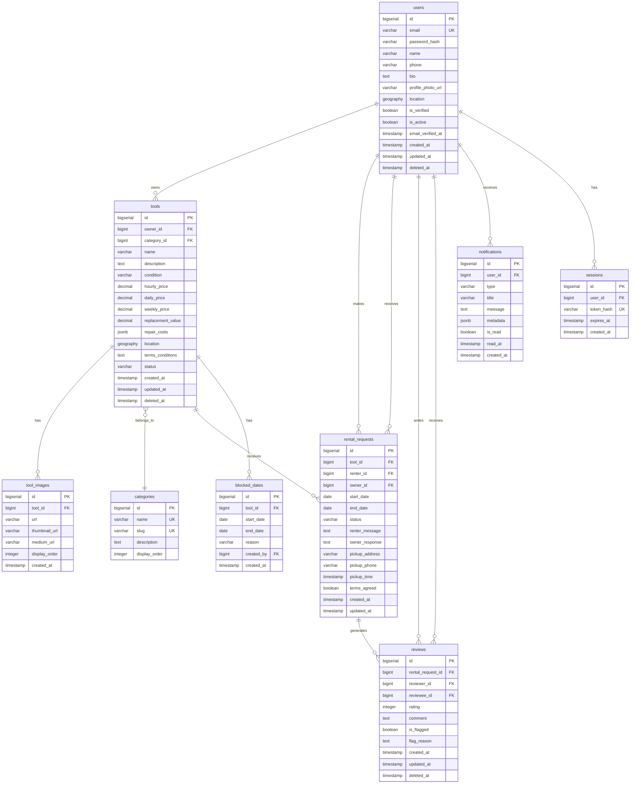

# Ubertool PostgreSQL Database Schema

## 1. Schema Overview

This document defines the complete PostgreSQL database schema for the Ubertool platform, including tables, relationships, indexes, and constraints.

### 1.1 Database Configuration
- **Database Name:** ubertool
- **PostgreSQL Version:** 15+
- **Extensions Required:**
  - `uuid-ossp` - UUID generation
  - `postgis` - Geospatial data types and functions
  - `pg_trgm` - Trigram-based text search

### 1.2 Entity Relationship Diagram



## 2. Table Definitions

### 2.1 Users Table

```sql
CREATE TABLE users (
    id BIGSERIAL PRIMARY KEY,
    email VARCHAR(255) NOT NULL UNIQUE,
    password_hash VARCHAR(255) NOT NULL,
    name VARCHAR(255) NOT NULL,
    phone VARCHAR(20),
    bio TEXT,
    profile_photo_url VARCHAR(500),
    location GEOGRAPHY(POINT, 4326), -- PostGIS type for lat/lng
    aggregate_rating DECIMAL(3, 2) DEFAULT 0.00,
    review_count INTEGER DEFAULT 0,
    is_verified BOOLEAN DEFAULT FALSE,
    is_active BOOLEAN DEFAULT TRUE,
    email_verified_at TIMESTAMP,
    created_at TIMESTAMP DEFAULT CURRENT_TIMESTAMP,
    updated_at TIMESTAMP DEFAULT CURRENT_TIMESTAMP,
    deleted_at TIMESTAMP,
    
    CONSTRAINT email_format CHECK (email ~* '^[A-Za-z0-9._%+-]+@[A-Za-z0-9.-]+\.[A-Za-z]{2,}$'),
    CONSTRAINT rating_range CHECK (aggregate_rating >= 0 AND aggregate_rating <= 5),
    CONSTRAINT review_count_positive CHECK (review_count >= 0)
);

CREATE INDEX idx_users_email ON users(email) WHERE deleted_at IS NULL;
CREATE INDEX idx_users_location ON users USING GIST(location) WHERE deleted_at IS NULL;
CREATE INDEX idx_users_created_at ON users(created_at);
```

**Columns:**
- `id`: Primary key, auto-incrementing
- `email`: Unique email address, used for login
- `password_hash`: bcrypt hashed password
- `name`: User's full name
- `phone`: Contact phone number (optional)
- `bio`: User bio/description (optional)
- `profile_photo_url`: URL to profile photo in S3
- `location`: Geographic coordinates (PostGIS POINT)
- `aggregate_rating`: Calculated average rating (0-5)
- `review_count`: Total number of reviews received
- `is_verified`: Email verification status
- `is_active`: Account active status
- `email_verified_at`: Timestamp of email verification
- `created_at`: Account creation timestamp
- `updated_at`: Last update timestamp
- `deleted_at`: Soft delete timestamp (NULL if active)

---

### 2.2 Categories Table

```sql
CREATE TABLE categories (
    id BIGSERIAL PRIMARY KEY,
    name VARCHAR(100) NOT NULL UNIQUE,
    slug VARCHAR(100) NOT NULL UNIQUE,
    description TEXT,
    display_order INTEGER DEFAULT 0,
    created_at TIMESTAMP DEFAULT CURRENT_TIMESTAMP,
    updated_at TIMESTAMP DEFAULT CURRENT_TIMESTAMP
);

CREATE INDEX idx_categories_slug ON categories(slug);
CREATE INDEX idx_categories_display_order ON categories(display_order);
```

**Seed Data:**
```sql
INSERT INTO categories (name, slug, description, display_order) VALUES
('Power Tools', 'power-tools', 'Electric and battery-powered tools', 1),
('Hand Tools', 'hand-tools', 'Manual tools and equipment', 2),
('Garden & Outdoor', 'garden-outdoor', 'Lawn, garden, and outdoor equipment', 3),
('Ladders & Scaffolding', 'ladders-scaffolding', 'Access equipment', 4),
('Automotive', 'automotive', 'Car maintenance and repair tools', 5),
('Painting & Decorating', 'painting-decorating', 'Painting supplies and equipment', 6),
('Plumbing', 'plumbing', 'Plumbing tools and equipment', 7),
('Electrical', 'electrical', 'Electrical tools and testers', 8),
('Woodworking', 'woodworking', 'Carpentry and woodworking tools', 9),
('Other', 'other', 'Miscellaneous tools', 99);
```

---

### 2.3 Tools Table

```sql
CREATE TABLE tools (
    id BIGSERIAL PRIMARY KEY,
    owner_id BIGINT NOT NULL REFERENCES users(id) ON DELETE CASCADE,
    category_id BIGINT NOT NULL REFERENCES categories(id) ON DELETE RESTRICT,
    name VARCHAR(255) NOT NULL,
    description TEXT NOT NULL,
    condition VARCHAR(20) NOT NULL CHECK (condition IN ('excellent', 'good', 'fair', 'poor')),
    hourly_price DECIMAL(10, 2),
    daily_price DECIMAL(10, 2),
    weekly_price DECIMAL(10, 2),
    replacement_value DECIMAL(10, 2) NOT NULL,
    repair_costs JSONB DEFAULT '[]'::jsonb, -- Array of {part: string, cost: number}
    location GEOGRAPHY(POINT, 4326) NOT NULL,
    terms_conditions TEXT,
    status VARCHAR(20) DEFAULT 'active' CHECK (status IN ('active', 'inactive', 'rented', 'archived')),
    view_count INTEGER DEFAULT 0,
    created_at TIMESTAMP DEFAULT CURRENT_TIMESTAMP,
    updated_at TIMESTAMP DEFAULT CURRENT_TIMESTAMP,
    deleted_at TIMESTAMP,
    
    CONSTRAINT price_positive CHECK (
        (hourly_price IS NULL OR hourly_price > 0) AND
        (daily_price IS NULL OR daily_price > 0) AND
        (weekly_price IS NULL OR weekly_price > 0)
    ),
    CONSTRAINT replacement_value_positive CHECK (replacement_value > 0),
    CONSTRAINT at_least_one_price CHECK (
        hourly_price IS NOT NULL OR 
        daily_price IS NOT NULL OR 
        weekly_price IS NOT NULL
    )
);

CREATE INDEX idx_tools_owner_id ON tools(owner_id) WHERE deleted_at IS NULL;
CREATE INDEX idx_tools_category_id ON tools(category_id) WHERE deleted_at IS NULL;
CREATE INDEX idx_tools_status ON tools(status) WHERE deleted_at IS NULL;
CREATE INDEX idx_tools_location ON tools USING GIST(location) WHERE deleted_at IS NULL;
CREATE INDEX idx_tools_created_at ON tools(created_at);
CREATE INDEX idx_tools_search ON tools USING GIN(to_tsvector('english', name || ' ' || description)) WHERE deleted_at IS NULL;
```

**Columns:**
- `id`: Primary key
- `owner_id`: Foreign key to users table
- `category_id`: Foreign key to categories table
- `name`: Tool name/title
- `description`: Detailed description
- `condition`: Tool condition (excellent, good, fair, poor)
- `hourly_price`: Hourly rental price (optional)
- `daily_price`: Daily rental price (optional)
- `weekly_price`: Weekly rental price (optional)
- `replacement_value`: Full replacement cost
- `repair_costs`: JSON array of repair costs by part
- `location`: Geographic coordinates
- `terms_conditions`: Owner's terms and conditions
- `status`: Listing status (active, inactive, rented, archived)
- `view_count`: Number of times viewed
- `created_at`: Creation timestamp
- `updated_at`: Last update timestamp
- `deleted_at`: Soft delete timestamp

---

### 2.4 Tool Images Table

```sql
CREATE TABLE tool_images (
    id BIGSERIAL PRIMARY KEY,
    tool_id BIGINT NOT NULL REFERENCES tools(id) ON DELETE CASCADE,
    url VARCHAR(500) NOT NULL, -- Full size image URL
    thumbnail_url VARCHAR(500) NOT NULL, -- 150x150
    medium_url VARCHAR(500) NOT NULL, -- 800x600
    display_order INTEGER DEFAULT 0,
    created_at TIMESTAMP DEFAULT CURRENT_TIMESTAMP,
    
    CONSTRAINT unique_tool_display_order UNIQUE(tool_id, display_order)
);

CREATE INDEX idx_tool_images_tool_id ON tool_images(tool_id);
CREATE INDEX idx_tool_images_display_order ON tool_images(tool_id, display_order);
```

---

### 2.5 Rental Requests Table

```sql
CREATE TABLE rental_requests (
    id BIGSERIAL PRIMARY KEY,
    tool_id BIGINT NOT NULL REFERENCES tools(id) ON DELETE CASCADE,
    renter_id BIGINT NOT NULL REFERENCES users(id) ON DELETE CASCADE,
    owner_id BIGINT NOT NULL REFERENCES users(id) ON DELETE CASCADE,
    start_date DATE NOT NULL,
    end_date DATE NOT NULL,
    status VARCHAR(20) DEFAULT 'pending' CHECK (status IN ('pending', 'accepted', 'rejected', 'cancelled', 'finalized')),
    renter_message TEXT,
    owner_response TEXT,
    pickup_address VARCHAR(500),
    pickup_phone VARCHAR(20),
    pickup_time TIMESTAMP,
    terms_agreed BOOLEAN DEFAULT FALSE,
    created_at TIMESTAMP DEFAULT CURRENT_TIMESTAMP,
    updated_at TIMESTAMP DEFAULT CURRENT_TIMESTAMP,
    
    CONSTRAINT valid_date_range CHECK (end_date > start_date),
    CONSTRAINT terms_must_be_agreed CHECK (terms_agreed = TRUE)
);

CREATE INDEX idx_rental_requests_tool_id ON rental_requests(tool_id);
CREATE INDEX idx_rental_requests_renter_id ON rental_requests(renter_id);
CREATE INDEX idx_rental_requests_owner_id ON rental_requests(owner_id);
CREATE INDEX idx_rental_requests_status ON rental_requests(status);
CREATE INDEX idx_rental_requests_dates ON rental_requests(start_date, end_date);
CREATE INDEX idx_rental_requests_tool_dates_status ON rental_requests(tool_id, start_date, end_date, status);
CREATE INDEX idx_rental_requests_created_at ON rental_requests(created_at);
```

**Columns:**
- `id`: Primary key
- `tool_id`: Foreign key to tools table
- `renter_id`: Foreign key to users (renter)
- `owner_id`: Foreign key to users (owner)
- `start_date`: Rental start date (DATE type for day-based scheduling)
- `end_date`: Rental end date (DATE type, inclusive)
- `status`: Request status (pending, accepted, rejected, cancelled, finalized)
- `renter_message`: Optional message from renter to owner
- `owner_response`: Optional response from owner
- `pickup_address`: Exact pickup address (provided on acceptance)
- `pickup_phone`: Owner's phone number (provided on acceptance)
- `pickup_time`: Suggested pickup time
- `terms_agreed`: Renter agreement to terms (must be TRUE)
- `created_at`: Request creation timestamp
- `updated_at`: Last update timestamp

**Day-Based Scheduling:**
- `start_date` and `end_date` are DATE types (not TIMESTAMP)
- Dates are inclusive (both start and end dates count as rental days)
- Minimum rental period: 1 day
- Maximum rental period: 30 days (enforced by application logic)

**State Transitions:**
- `pending` → `accepted`, `rejected`, `cancelled`
- `accepted` → `finalized`, `cancelled`
- `rejected` → (terminal state)
- `cancelled` → (terminal state)
- `finalized` → (terminal state)

---

### 2.6 Blocked Dates Table

```sql
CREATE TABLE blocked_dates (
    id BIGSERIAL PRIMARY KEY,
    tool_id BIGINT NOT NULL REFERENCES tools(id) ON DELETE CASCADE,
    start_date DATE NOT NULL,
    end_date DATE NOT NULL,
    reason VARCHAR(100) CHECK (reason IN ('maintenance', 'personal_use', 'vacation', 'other')),
    notes TEXT,
    created_by BIGINT NOT NULL REFERENCES users(id) ON DELETE CASCADE,
    created_at TIMESTAMP DEFAULT CURRENT_TIMESTAMP,
    
    CONSTRAINT valid_blocked_date_range CHECK (end_date >= start_date)
);

CREATE INDEX idx_blocked_dates_tool_id ON blocked_dates(tool_id);
CREATE INDEX idx_blocked_dates_dates ON blocked_dates(start_date, end_date);
CREATE INDEX idx_blocked_dates_tool_dates ON blocked_dates(tool_id, start_date, end_date);
```

**Columns:**
- `id`: Primary key
- `tool_id`: Foreign key to tools table
- `start_date`: Block start date (DATE type)
- `end_date`: Block end date (DATE type, inclusive)
- `reason`: Reason for blocking (maintenance, personal_use, vacation, other)
- `notes`: Optional notes about the block
- `created_by`: Foreign key to users (owner who created the block)
- `created_at`: Block creation timestamp

**Business Rules:**
- Owners can only block their own tools
- Cannot block dates with finalized or accepted rentals
- Can block dates with pending requests (requests remain pending)
- Blocked dates prevent new rental requests from being accepted

---

### 2.7 Reviews Table

```sql
CREATE TABLE reviews (
    id BIGSERIAL PRIMARY KEY,
    rental_request_id BIGINT NOT NULL REFERENCES rental_requests(id) ON DELETE CASCADE,
    reviewer_id BIGINT NOT NULL REFERENCES users(id) ON DELETE CASCADE,
    reviewee_id BIGINT NOT NULL REFERENCES users(id) ON DELETE CASCADE,
    rating INTEGER NOT NULL CHECK (rating >= 1 AND rating <= 5),
    comment TEXT,
    is_flagged BOOLEAN DEFAULT FALSE,
    flag_reason TEXT,
    created_at TIMESTAMP DEFAULT CURRENT_TIMESTAMP,
    updated_at TIMESTAMP DEFAULT CURRENT_TIMESTAMP,
    deleted_at TIMESTAMP,
    
    CONSTRAINT unique_review_per_rental_per_user UNIQUE(rental_request_id, reviewer_id),
    CONSTRAINT comment_length CHECK (LENGTH(comment) <= 500)
);

CREATE INDEX idx_reviews_rental_request_id ON reviews(rental_request_id);
CREATE INDEX idx_reviews_reviewer_id ON reviews(reviewer_id);
CREATE INDEX idx_reviews_reviewee_id ON reviews(reviewee_id) WHERE deleted_at IS NULL;
CREATE INDEX idx_reviews_created_at ON reviews(created_at) WHERE deleted_at IS NULL;
CREATE INDEX idx_reviews_flagged ON reviews(is_flagged) WHERE is_flagged = TRUE;
```

**Business Rules:**
- Only reviewee's reviews from last 2 years count toward aggregate rating
- One review per rental per user (enforced by unique constraint)
- Rating must be 1-5 stars
- Comment max 500 characters

---

### 2.8 Notifications Table

```sql
CREATE TABLE notifications (
    id BIGSERIAL PRIMARY KEY,
    user_id BIGINT NOT NULL REFERENCES users(id) ON DELETE CASCADE,
    type VARCHAR(50) NOT NULL CHECK (type IN (
        'rental_request_received',
        'rental_request_accepted',
        'rental_request_rejected',
        'rental_request_finalized',
        'rental_request_cancelled',
        'review_received',
        'email_verification',
        'password_reset'
    )),
    title VARCHAR(255) NOT NULL,
    message TEXT NOT NULL,
    metadata JSONB DEFAULT '{}'::jsonb, -- Additional data (e.g., request_id, tool_id)
    is_read BOOLEAN DEFAULT FALSE,
    read_at TIMESTAMP,
    created_at TIMESTAMP DEFAULT CURRENT_TIMESTAMP
);

CREATE INDEX idx_notifications_user_id ON notifications(user_id);
CREATE INDEX idx_notifications_is_read ON notifications(user_id, is_read);
CREATE INDEX idx_notifications_created_at ON notifications(created_at);

-- Partition by month for performance (optional, for high volume)
-- CREATE TABLE notifications_2026_01 PARTITION OF notifications
-- FOR VALUES FROM ('2026-01-01') TO ('2026-02-01');
```

---

### 2.9 Sessions Table

```sql
CREATE TABLE sessions (
    id BIGSERIAL PRIMARY KEY,
    user_id BIGINT NOT NULL REFERENCES users(id) ON DELETE CASCADE,
    token_hash VARCHAR(255) NOT NULL UNIQUE, -- Hashed refresh token
    expires_at TIMESTAMP NOT NULL,
    created_at TIMESTAMP DEFAULT CURRENT_TIMESTAMP,
    
    CONSTRAINT valid_expiration CHECK (expires_at > created_at)
);

CREATE INDEX idx_sessions_user_id ON sessions(user_id);
CREATE INDEX idx_sessions_token_hash ON sessions(token_hash);
CREATE INDEX idx_sessions_expires_at ON sessions(expires_at);

-- Cleanup expired sessions periodically
-- DELETE FROM sessions WHERE expires_at < CURRENT_TIMESTAMP;
```

---

### 2.10 Notification Preferences Table

```sql
CREATE TABLE notification_preferences (
    id BIGSERIAL PRIMARY KEY,
    user_id BIGINT NOT NULL REFERENCES users(id) ON DELETE CASCADE UNIQUE,
    email_rental_request BOOLEAN DEFAULT TRUE,
    email_rental_accepted BOOLEAN DEFAULT TRUE,
    email_rental_rejected BOOLEAN DEFAULT TRUE,
    email_rental_finalized BOOLEAN DEFAULT TRUE,
    email_rental_cancelled BOOLEAN DEFAULT TRUE,
    email_review_received BOOLEAN DEFAULT TRUE,
    push_rental_request BOOLEAN DEFAULT TRUE,
    push_rental_accepted BOOLEAN DEFAULT TRUE,
    push_rental_rejected BOOLEAN DEFAULT TRUE,
    push_rental_finalized BOOLEAN DEFAULT TRUE,
    push_rental_cancelled BOOLEAN DEFAULT TRUE,
    push_review_received BOOLEAN DEFAULT TRUE,
    created_at TIMESTAMP DEFAULT CURRENT_TIMESTAMP,
    updated_at TIMESTAMP DEFAULT CURRENT_TIMESTAMP
);

CREATE INDEX idx_notification_preferences_user_id ON notification_preferences(user_id);
```

---

## 3. Views

### 3.1 Active Tools View

```sql
CREATE VIEW active_tools_view AS
SELECT 
    t.*,
    u.name AS owner_name,
    u.aggregate_rating AS owner_rating,
    u.profile_photo_url AS owner_photo,
    c.name AS category_name,
    c.slug AS category_slug,
    (SELECT url FROM tool_images WHERE tool_id = t.id ORDER BY display_order LIMIT 1) AS primary_image_url
FROM tools t
JOIN users u ON t.owner_id = u.id
JOIN categories c ON t.category_id = c.id
WHERE t.deleted_at IS NULL 
  AND t.status = 'active'
  AND u.deleted_at IS NULL
  AND u.is_active = TRUE;
```

### 3.2 User Ratings Summary View

```sql
CREATE VIEW user_ratings_summary AS
SELECT 
    u.id AS user_id,
    u.name,
    u.aggregate_rating,
    u.review_count,
    COUNT(CASE WHEN r.rating = 5 THEN 1 END) AS five_star_count,
    COUNT(CASE WHEN r.rating = 4 THEN 1 END) AS four_star_count,
    COUNT(CASE WHEN r.rating = 3 THEN 1 END) AS three_star_count,
    COUNT(CASE WHEN r.rating = 2 THEN 1 END) AS two_star_count,
    COUNT(CASE WHEN r.rating = 1 THEN 1 END) AS one_star_count
FROM users u
LEFT JOIN reviews r ON u.id = r.reviewee_id 
    AND r.deleted_at IS NULL
    AND r.created_at > CURRENT_TIMESTAMP - INTERVAL '2 years'
WHERE u.deleted_at IS NULL
GROUP BY u.id, u.name, u.aggregate_rating, u.review_count;
```

---

## 4. Functions & Triggers

### 4.1 Update Timestamp Trigger

```sql
CREATE OR REPLACE FUNCTION update_updated_at_column()
RETURNS TRIGGER AS $$
BEGIN
    NEW.updated_at = CURRENT_TIMESTAMP;
    RETURN NEW;
END;
$$ LANGUAGE plpgsql;

-- Apply to tables with updated_at column
CREATE TRIGGER update_users_updated_at BEFORE UPDATE ON users
    FOR EACH ROW EXECUTE FUNCTION update_updated_at_column();

CREATE TRIGGER update_tools_updated_at BEFORE UPDATE ON tools
    FOR EACH ROW EXECUTE FUNCTION update_updated_at_column();

CREATE TRIGGER update_rental_requests_updated_at BEFORE UPDATE ON rental_requests
    FOR EACH ROW EXECUTE FUNCTION update_updated_at_column();

CREATE TRIGGER update_reviews_updated_at BEFORE UPDATE ON reviews
    FOR EACH ROW EXECUTE FUNCTION update_updated_at_column();

CREATE TRIGGER update_categories_updated_at BEFORE UPDATE ON categories
    FOR EACH ROW EXECUTE FUNCTION update_updated_at_column();

CREATE TRIGGER update_notification_preferences_updated_at BEFORE UPDATE ON notification_preferences
    FOR EACH ROW EXECUTE FUNCTION update_updated_at_column();
```

### 4.2 Recalculate User Rating Function

```sql
CREATE OR REPLACE FUNCTION recalculate_user_rating(p_user_id BIGINT)
RETURNS VOID AS $$
DECLARE
    v_avg_rating DECIMAL(3, 2);
    v_review_count INTEGER;
BEGIN
    SELECT 
        COALESCE(AVG(rating), 0),
        COUNT(*)
    INTO v_avg_rating, v_review_count
    FROM reviews
    WHERE reviewee_id = p_user_id
      AND deleted_at IS NULL
      AND created_at > CURRENT_TIMESTAMP - INTERVAL '2 years';
    
    UPDATE users
    SET aggregate_rating = v_avg_rating,
        review_count = v_review_count
    WHERE id = p_user_id;
END;
$$ LANGUAGE plpgsql;
```

### 4.3 Auto-Recalculate Rating Trigger

```sql
CREATE OR REPLACE FUNCTION trigger_recalculate_rating()
RETURNS TRIGGER AS $$
BEGIN
    IF TG_OP = 'INSERT' OR TG_OP = 'UPDATE' THEN
        PERFORM recalculate_user_rating(NEW.reviewee_id);
    ELSIF TG_OP = 'DELETE' THEN
        PERFORM recalculate_user_rating(OLD.reviewee_id);
    END IF;
    RETURN NULL;
END;
$$ LANGUAGE plpgsql;

CREATE TRIGGER recalculate_rating_on_review_change
AFTER INSERT OR UPDATE OR DELETE ON reviews
FOR EACH ROW EXECUTE FUNCTION trigger_recalculate_rating();
```

### 4.4 Distance Calculation Function

```sql
CREATE OR REPLACE FUNCTION calculate_distance_miles(
    lat1 DOUBLE PRECISION,
    lng1 DOUBLE PRECISION,
    lat2 DOUBLE PRECISION,
    lng2 DOUBLE PRECISION
)
RETURNS DOUBLE PRECISION AS $$
BEGIN
    RETURN ST_Distance(
        ST_MakePoint(lng1, lat1)::geography,
        ST_MakePoint(lng2, lat2)::geography
    ) * 0.000621371; -- Convert meters to miles
END;
$$ LANGUAGE plpgsql IMMUTABLE;
```

---

## 5. Sample Queries

### 5.1 Search Tools by Proximity

```sql
SELECT 
    t.id,
    t.name,
    t.description,
    t.daily_price,
    t.condition,
    u.name AS owner_name,
    u.aggregate_rating AS owner_rating,
    ST_Distance(t.location, ST_MakePoint($2, $1)::geography) * 0.000621371 AS distance_miles
FROM tools t
JOIN users u ON t.owner_id = u.id
WHERE t.deleted_at IS NULL
  AND t.status = 'active'
  AND ST_DWithin(t.location, ST_MakePoint($2, $1)::geography, $3 * 1609.34) -- $3 is radius in miles
  AND ($4::VARCHAR IS NULL OR t.category_id = $4)
  AND ($5::DECIMAL IS NULL OR t.daily_price >= $5)
  AND ($6::DECIMAL IS NULL OR t.daily_price <= $6)
ORDER BY distance_miles ASC
LIMIT $7 OFFSET $8;
```

### 5.2 Full-Text Search

```sql
SELECT 
    t.id,
    t.name,
    t.description,
    ts_rank(to_tsvector('english', t.name || ' ' || t.description), plainto_tsquery('english', $1)) AS rank
FROM tools t
WHERE t.deleted_at IS NULL
  AND t.status = 'active'
  AND to_tsvector('english', t.name || ' ' || t.description) @@ plainto_tsquery('english', $1)
ORDER BY rank DESC
LIMIT 20;
```

### 5.3 Check for Overlapping Rentals (Day-Based)

```sql
-- Check if requested date range overlaps with existing rentals or blocks
SELECT COUNT(*) 
FROM rental_requests
WHERE tool_id = $1
  AND status IN ('accepted', 'finalized')
  AND start_date <= $3  -- $3 is new end_date
  AND end_date >= $2;   -- $2 is new start_date

-- Also check blocked dates
SELECT COUNT(*)
FROM blocked_dates
WHERE tool_id = $1
  AND start_date <= $3
  AND end_date >= $2;
```

### 5.4 Get Tool Schedule (Availability Calendar)

```sql
-- Get all blocked dates and rentals for a tool within a date range
SELECT 
    'rental' AS type,
    rr.id,
    rr.start_date,
    rr.end_date,
    rr.status,
    u.name AS renter_name
FROM rental_requests rr
JOIN users u ON rr.renter_id = u.id
WHERE rr.tool_id = $1
  AND rr.status IN ('accepted', 'finalized', 'pending')
  AND rr.start_date <= $3  -- end of range
  AND rr.end_date >= $2    -- start of range

UNION ALL

SELECT 
    'blocked' AS type,
    bd.id,
    bd.start_date,
    bd.end_date,
    bd.reason AS status,
    NULL AS renter_name
FROM blocked_dates bd
WHERE bd.tool_id = $1
  AND bd.start_date <= $3
  AND bd.end_date >= $2

ORDER BY start_date;
```

### 5.5 Get User's Recent Reviews (2-year window)

```sql
SELECT 
    r.id,
    r.rating,
    r.comment,
    r.created_at,
    u.name AS reviewer_name,
    u.profile_photo_url AS reviewer_photo,
    t.name AS tool_name
FROM reviews r
JOIN users u ON r.reviewer_id = u.id
JOIN rental_requests rr ON r.rental_request_id = rr.id
JOIN tools t ON rr.tool_id = t.id
WHERE r.reviewee_id = $1
  AND r.deleted_at IS NULL
  AND r.created_at > CURRENT_TIMESTAMP - INTERVAL '2 years'
ORDER BY r.created_at DESC
LIMIT 20;
```

---

## 6. Migration Strategy

### 6.1 Initial Migration
```sql
-- migrations/001_initial_schema.sql
-- Run all CREATE TABLE statements in dependency order:
-- 1. users
-- 2. categories
-- 3. tools
-- 4. tool_images
-- 5. rental_requests
-- 6. blocked_dates
-- 7. reviews
-- 8. notifications
-- 9. sessions
-- 10. notification_preferences
```

### 6.2 Seed Data Migration
```sql
-- migrations/002_seed_categories.sql
-- Insert category data
```

### 6.3 Functions and Triggers
```sql
-- migrations/003_functions_triggers.sql
-- Create all functions and triggers
```

---

## 7. Performance Optimization

### 7.1 Connection Pooling
- Min connections: 10
- Max connections: 100
- Idle timeout: 10 minutes

### 7.2 Query Optimization
- Use EXPLAIN ANALYZE for slow queries
- Add indexes based on query patterns
- Use materialized views for complex aggregations
- Implement query result caching in Redis

### 7.3 Partitioning (Future)
- Partition `notifications` by month
- Partition `rental_requests` by year
- Archive old data to separate tables

---

## 8. Backup & Maintenance

### 8.1 Backup Schedule
- Full backup: Daily at 2 AM UTC
- Incremental backup: Hourly
- Retention: 30 days
- Test restore: Monthly

### 8.2 Maintenance Tasks
```sql
-- Vacuum and analyze (weekly)
VACUUM ANALYZE;

-- Reindex (monthly)
REINDEX DATABASE ubertool;

-- Clean up expired sessions (daily)
DELETE FROM sessions WHERE expires_at < CURRENT_TIMESTAMP;

-- Archive old notifications (monthly)
DELETE FROM notifications WHERE created_at < CURRENT_TIMESTAMP - INTERVAL '90 days';
```

---

This schema provides a solid foundation for the Ubertool platform with proper normalization, indexing, and data integrity constraints.
