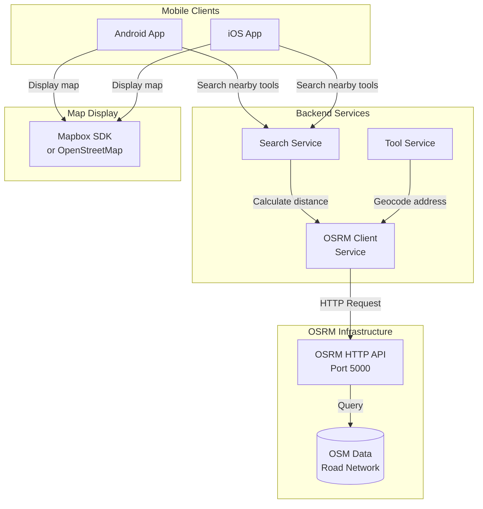

# OSRM Integration Design

## Overview

Open Source Routing Machine (OSRM) is a high-performance routing engine for shortest paths in road networks. It will replace Google Maps API for distance calculations and routing in the Ubertool platform, providing:

- **Cost savings:** No API usage fees
- **Privacy:** Self-hosted, no data sharing with third parties
- **Performance:** Optimized for fast routing queries
- **Control:** Full control over routing data and updates

---

## Architecture



---

## OSRM Deployment

### Docker Compose Setup

```yaml
# docker-compose.yml

version: '3.8'

services:
  osrm-backend:
    image: osrm/osrm-backend:latest
    container_name: osrm-backend
    ports:
      - "5000:5000"
    volumes:
      - ./osrm-data:/data
    command: osrm-routed --algorithm mld /data/us-west-latest.osrm
    restart: unless-stopped
    networks:
      - ubertool-network
    healthcheck:
      test: ["CMD", "curl", "-f", "http://localhost:5000/health"]
      interval: 30s
      timeout: 10s
      retries: 3

networks:
  ubertool-network:
    driver: bridge
```

### Data Preparation Script

```bash
#!/bin/bash
# scripts/prepare-osrm-data.sh

# Download OpenStreetMap data for your region
# Example: US West Coast
wget https://download.geofabrik.de/north-america/us-west-latest.osm.pbf -O osrm-data/us-west-latest.osm.pbf

# Extract road network
docker run -t -v "${PWD}/osrm-data:/data" osrm/osrm-backend osrm-extract \
  -p /opt/car.lua /data/us-west-latest.osm.pbf

# Partition the graph
docker run -t -v "${PWD}/osrm-data:/data" osrm/osrm-backend osrm-partition \
  /data/us-west-latest.osrm

# Customize the graph
docker run -t -v "${PWD}/osrm-data:/data" osrm/osrm-backend osrm-customize \
  /data/us-west-latest.osrm

echo "OSRM data preparation complete!"
```

---

## OSRM Client Service (TypeScript)

```typescript
// src/services/osrm/osrm.service.ts

import axios, { AxiosInstance } from 'axios';
import { Logger } from '../utils/logger';

export interface Coordinate {
  latitude: number;
  longitude: number;
}

export interface RouteResult {
  distance: number;  // meters
  duration: number;  // seconds
  geometry?: string; // Polyline encoded route
}

export interface DistanceMatrixResult {
  distances: number[][];  // meters
  durations: number[][];  // seconds
}

export class OSRMService {
  private client: AxiosInstance;
  private logger: Logger;
  private baseUrl: string;

  constructor() {
    this.baseUrl = process.env.OSRM_BASE_URL || 'http://localhost:5000';
    this.logger = new Logger('OSRMService');
    
    this.client = axios.create({
      baseURL: this.baseUrl,
      timeout: 5000,
      headers: {
        'Content-Type': 'application/json',
      },
    });
  }

  /**
   * Calculate distance and duration between two points
   */
  async getRoute(
    origin: Coordinate,
    destination: Coordinate,
    includeGeometry: boolean = false
  ): Promise<RouteResult> {
    try {
      const coords = `${origin.longitude},${origin.latitude};${destination.longitude},${destination.latitude}`;
      
      const response = await this.client.get(`/route/v1/driving/${coords}`, {
        params: {
          overview: includeGeometry ? 'full' : 'false',
          geometries: 'polyline',
        },
      });

      if (response.data.code !== 'Ok') {
        throw new Error(`OSRM error: ${response.data.code}`);
      }

      const route = response.data.routes[0];

      return {
        distance: route.distance,  // meters
        duration: route.duration,  // seconds
        geometry: includeGeometry ? route.geometry : undefined,
      };
    } catch (error: any) {
      this.logger.error('Error getting route from OSRM', error);
      throw error;
    }
  }

  /**
   * Calculate distance in miles between two points
   */
  async getDistanceInMiles(
    origin: Coordinate,
    destination: Coordinate
  ): Promise<number> {
    const route = await this.getRoute(origin, destination);
    return route.distance * 0.000621371;  // Convert meters to miles
  }

  /**
   * Calculate distance in kilometers between two points
   */
  async getDistanceInKilometers(
    origin: Coordinate,
    destination: Coordinate
  ): Promise<number> {
    const route = await this.getRoute(origin, destination);
    return route.distance / 1000;  // Convert meters to kilometers
  }

  /**
   * Calculate distance matrix for multiple origins and destinations
   * Useful for finding nearest tools
   */
  async getDistanceMatrix(
    origins: Coordinate[],
    destinations: Coordinate[]
  ): Promise<DistanceMatrixResult> {
    try {
      // OSRM table service requires all coordinates in one list
      const allCoords = [...origins, ...destinations];
      const coordsString = allCoords
        .map(c => `${c.longitude},${c.latitude}`)
        .join(';');

      const sources = origins.map((_, i) => i).join(';');
      const destinationsIndices = destinations
        .map((_, i) => i + origins.length)
        .join(';');

      const response = await this.client.get(`/table/v1/driving/${coordsString}`, {
        params: {
          sources,
          destinations: destinationsIndices,
        },
      });

      if (response.data.code !== 'Ok') {
        throw new Error(`OSRM error: ${response.data.code}`);
      }

      return {
        distances: response.data.distances,  // meters
        durations: response.data.durations,  // seconds
      };
    } catch (error: any) {
      this.logger.error('Error getting distance matrix from OSRM', error);
      throw error;
    }
  }

  /**
   * Find nearest point on road network (for geocoding)
   */
  async snapToRoad(coordinate: Coordinate): Promise<Coordinate> {
    try {
      const coords = `${coordinate.longitude},${coordinate.latitude}`;
      
      const response = await this.client.get(`/nearest/v1/driving/${coords}`);

      if (response.data.code !== 'Ok') {
        throw new Error(`OSRM error: ${response.data.code}`);
      }

      const waypoint = response.data.waypoints[0];

      return {
        latitude: waypoint.location[1],
        longitude: waypoint.location[0],
      };
    } catch (error: any) {
      this.logger.error('Error snapping to road', error);
      throw error;
    }
  }

  /**
   * Health check for OSRM service
   */
  async healthCheck(): Promise<boolean> {
    try {
      const response = await this.client.get('/health');
      return response.status === 200;
    } catch (error) {
      this.logger.error('OSRM health check failed', error);
      return false;
    }
  }

  /**
   * Calculate straight-line distance (Haversine formula)
   * Fallback when OSRM is unavailable
   */
  static haversineDistance(coord1: Coordinate, coord2: Coordinate): number {
    const R = 6371; // Earth's radius in kilometers
    const dLat = this.toRadians(coord2.latitude - coord1.latitude);
    const dLon = this.toRadians(coord2.longitude - coord1.longitude);

    const a =
      Math.sin(dLat / 2) * Math.sin(dLat / 2) +
      Math.cos(this.toRadians(coord1.latitude)) *
        Math.cos(this.toRadians(coord2.latitude)) *
        Math.sin(dLon / 2) *
        Math.sin(dLon / 2);

    const c = 2 * Math.atan2(Math.sqrt(a), Math.sqrt(1 - a));
    return R * c; // Distance in kilometers
  }

  private static toRadians(degrees: number): number {
    return degrees * (Math.PI / 180);
  }
}
```

---

## Search Service Integration

```typescript
// src/services/search.service.ts

import { OSRMService, Coordinate } from './osrm/osrm.service';
import { PrismaClient } from '@prisma/client';

export class SearchService {
  private osrm: OSRMService;
  private prisma: PrismaClient;

  constructor() {
    this.osrm = new OSRMService();
    this.prisma = new PrismaClient();
  }

  /**
   * Search tools near a location
   */
  async searchNearbyTools(
    userLocation: Coordinate,
    maxDistanceMiles: number = 10,
    limit: number = 20
  ) {
    // 1. Get tools within bounding box (fast PostgreSQL query)
    const boundingBox = this.calculateBoundingBox(userLocation, maxDistanceMiles);
    
    const tools = await this.prisma.tools.findMany({
      where: {
        status: 'active',
        latitude: {
          gte: boundingBox.minLat,
          lte: boundingBox.maxLat,
        },
        longitude: {
          gte: boundingBox.minLng,
          lte: boundingBox.maxLng,
        },
      },
      take: limit * 2, // Get more than needed for filtering
    });

    if (tools.length === 0) {
      return [];
    }

    // 2. Calculate actual road distances using OSRM
    const toolCoords: Coordinate[] = tools.map(t => ({
      latitude: t.latitude,
      longitude: t.longitude,
    }));

    const matrix = await this.osrm.getDistanceMatrix(
      [userLocation],
      toolCoords
    );

    // 3. Filter by actual distance and sort
    const toolsWithDistance = tools
      .map((tool, index) => ({
        ...tool,
        distance: matrix.distances[0][index] * 0.000621371, // meters to miles
        duration: matrix.durations[0][index], // seconds
      }))
      .filter(tool => tool.distance <= maxDistanceMiles)
      .sort((a, b) => a.distance - b.distance)
      .slice(0, limit);

    return toolsWithDistance;
  }

  /**
   * Calculate bounding box for initial filtering
   */
  private calculateBoundingBox(center: Coordinate, radiusMiles: number) {
    const radiusKm = radiusMiles * 1.60934;
    const latDelta = radiusKm / 111; // 1 degree latitude ≈ 111 km
    const lngDelta = radiusKm / (111 * Math.cos(center.latitude * Math.PI / 180));

    return {
      minLat: center.latitude - latDelta,
      maxLat: center.latitude + latDelta,
      minLng: center.longitude - lngDelta,
      maxLng: center.longitude + lngDelta,
    };
  }
}
```

---

## Geocoding Service (Nominatim)

For address-to-coordinates conversion, use Nominatim (OpenStreetMap's geocoding service):

```typescript
// src/services/geocoding/nominatim.service.ts

import axios, { AxiosInstance } from 'axios';
import { Coordinate } from '../osrm/osrm.service';

export interface GeocodingResult {
  coordinate: Coordinate;
  formattedAddress: string;
  placeId: string;
}

export class NominatimService {
  private client: AxiosInstance;

  constructor() {
    const baseUrl = process.env.NOMINATIM_BASE_URL || 'https://nominatim.openstreetmap.org';
    
    this.client = axios.create({
      baseURL: baseUrl,
      timeout: 5000,
      headers: {
        'User-Agent': 'Ubertool/1.0', // Required by Nominatim
      },
    });
  }

  /**
   * Geocode address to coordinates
   */
  async geocode(address: string): Promise<GeocodingResult | null> {
    try {
      const response = await this.client.get('/search', {
        params: {
          q: address,
          format: 'json',
          limit: 1,
        },
      });

      if (response.data.length === 0) {
        return null;
      }

      const result = response.data[0];

      return {
        coordinate: {
          latitude: parseFloat(result.lat),
          longitude: parseFloat(result.lon),
        },
        formattedAddress: result.display_name,
        placeId: result.place_id,
      };
    } catch (error) {
      console.error('Geocoding error:', error);
      return null;
    }
  }

  /**
   * Reverse geocode coordinates to address
   */
  async reverseGeocode(coordinate: Coordinate): Promise<string | null> {
    try {
      const response = await this.client.get('/reverse', {
        params: {
          lat: coordinate.latitude,
          lon: coordinate.longitude,
          format: 'json',
        },
      });

      return response.data.display_name || null;
    } catch (error) {
      console.error('Reverse geocoding error:', error);
      return null;
    }
  }
}
```

---

## Mobile Client Integration

### Android (Kotlin)

```kotlin
// Use Mapbox SDK for map display
dependencies {
    implementation 'com.mapbox.maps:android:10.16.0'
}

// Display map with tool markers
class MapFragment : Fragment() {
    private lateinit var mapView: MapView
    
    override fun onViewCreated(view: View, savedInstanceState: Bundle?) {
        super.onViewCreated(view, savedInstanceState)
        
        mapView = view.findViewById(R.id.mapView)
        mapView.getMapboxMap().loadStyleUri(Style.MAPBOX_STREETS)
        
        // Add tool markers
        addToolMarkers(tools)
    }
    
    private fun addToolMarkers(tools: List<Tool>) {
        // Implementation using Mapbox annotations
    }
}
```

### iOS (Swift)

```swift
// Use Mapbox SDK for map display
import MapboxMaps

class MapViewController: UIViewController {
    var mapView: MapView!
    
    override func viewDidLoad() {
        super.viewDidLoad()
        
        mapView = MapView(frame: view.bounds)
        mapView.autoresizingMask = [.flexibleWidth, .flexibleHeight]
        view.addSubview(mapView)
        
        // Add tool markers
        addToolMarkers(tools: tools)
    }
    
    func addToolMarkers(tools: [Tool]) {
        // Implementation using Mapbox annotations
    }
}
```

---

## Environment Configuration

```env
# .env

# OSRM Configuration
OSRM_BASE_URL=http://localhost:5000
OSRM_TIMEOUT_MS=5000

# Nominatim Configuration (for geocoding)
NOMINATIM_BASE_URL=https://nominatim.openstreetmap.org
# Or self-hosted: http://localhost:8080

# Mapbox (for mobile map display)
MAPBOX_ACCESS_TOKEN=pk.your_mapbox_token_here
```

---

## Performance Optimization

### 1. Caching Strategy

```typescript
// Cache distance calculations
import { Redis } from 'ioredis';

export class OSRMCacheService {
  private redis: Redis;
  private osrm: OSRMService;

  async getDistanceWithCache(
    origin: Coordinate,
    destination: Coordinate
  ): Promise<number> {
    const cacheKey = this.generateCacheKey(origin, destination);
    
    // Check cache
    const cached = await this.redis.get(cacheKey);
    if (cached) {
      return parseFloat(cached);
    }

    // Calculate and cache
    const distance = await this.osrm.getDistanceInMiles(origin, destination);
    await this.redis.setex(cacheKey, 86400, distance.toString()); // 24h TTL
    
    return distance;
  }

  private generateCacheKey(coord1: Coordinate, coord2: Coordinate): string {
    // Round to 4 decimal places (~11m precision)
    const lat1 = coord1.latitude.toFixed(4);
    const lng1 = coord1.longitude.toFixed(4);
    const lat2 = coord2.latitude.toFixed(4);
    const lng2 = coord2.longitude.toFixed(4);
    
    return `osrm:distance:${lat1},${lng1}:${lat2},${lng2}`;
  }
}
```

### 2. Fallback to Haversine

```typescript
// Graceful degradation when OSRM is unavailable
async getDistanceWithFallback(
  origin: Coordinate,
  destination: Coordinate
): Promise<number> {
  try {
    return await this.osrm.getDistanceInMiles(origin, destination);
  } catch (error) {
    this.logger.warn('OSRM unavailable, using Haversine distance');
    const distanceKm = OSRMService.haversineDistance(origin, destination);
    return distanceKm * 0.621371; // Convert to miles
  }
}
```

---

## Monitoring & Maintenance

### Health Check Endpoint

```typescript
// src/routes/health.ts

router.get('/health/osrm', async (req, res) => {
  const osrm = new OSRMService();
  const isHealthy = await osrm.healthCheck();
  
  res.status(isHealthy ? 200 : 503).json({
    service: 'osrm',
    status: isHealthy ? 'healthy' : 'unhealthy',
    timestamp: new Date().toISOString(),
  });
});
```

### Data Update Schedule

```bash
#!/bin/bash
# Cron job to update OSM data weekly
# 0 2 * * 0 /path/to/update-osrm-data.sh

# Download latest OSM data
wget https://download.geofabrik.de/north-america/us-west-latest.osm.pbf \
  -O /tmp/us-west-latest.osm.pbf

# Prepare OSRM data
./scripts/prepare-osrm-data.sh

# Restart OSRM service
docker-compose restart osrm-backend
```

---

## Cost Comparison

| Feature | Google Maps API | OSRM (Self-Hosted) |
|---------|----------------|-------------------|
| **Setup Cost** | $0 | Server costs (~$50-100/month) |
| **Per Request** | $0.005 - $0.01 | $0 |
| **100K requests/month** | $500 - $1,000 | $0 (server cost only) |
| **1M requests/month** | $5,000 - $10,000 | $0 (server cost only) |
| **Data Privacy** | Shared with Google | Fully private |
| **Customization** | Limited | Full control |
| **Maintenance** | None | Regular updates needed |

**Break-even point:** ~10,000 requests/month

---

## Summary

✅ **Cost-effective** - No per-request fees after initial setup  
✅ **Privacy-focused** - All data stays on your infrastructure  
✅ **High performance** - Optimized for fast routing queries  
✅ **Offline capable** - Works without internet (for mobile caching)  
✅ **Open source** - Full control and customization  
✅ **Scalable** - Can handle millions of requests with proper infrastructure  

OSRM provides a robust, cost-effective alternative to Google Maps for the Ubertool platform!
