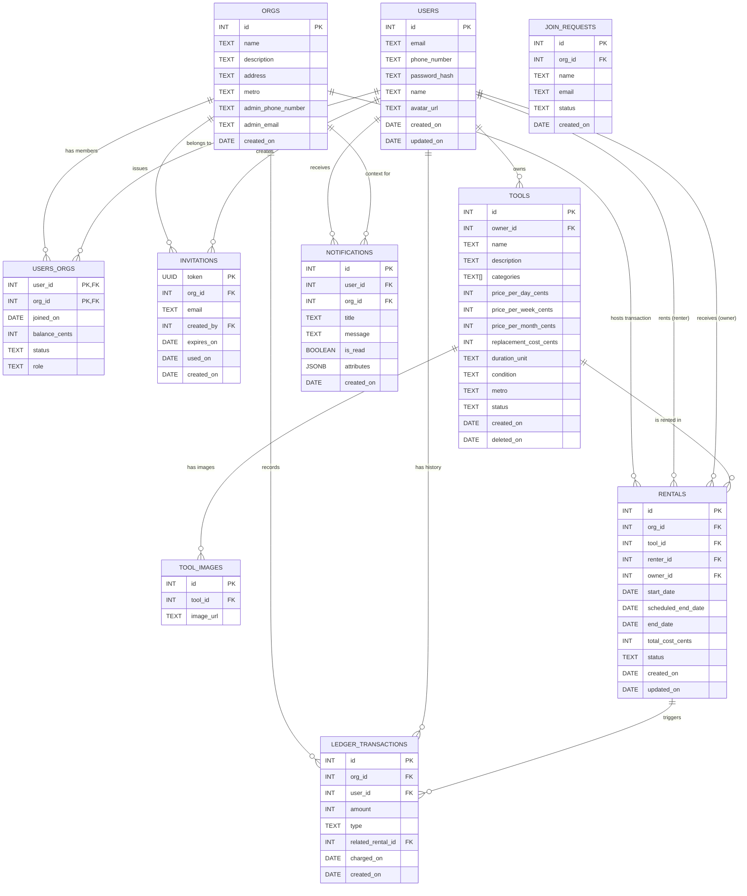

# Database Schema Diagram

This diagram visualizes the PostgreSQL schema defined in `ubertool_schema_trusted.sql`.

```mermaid
erDiagram
    ORGS {
        INT id PK
        TEXT name
        TEXT description
        TEXT address
        TEXT metro
        TEXT admin_phone_number
        TEXT admin_email
        DATE created_on
    }

    USERS {
        INT id PK
        TEXT email
        TEXT phone_number
        TEXT password_hash
        TEXT name
        TEXT avatar_url

        DATE created_on
        DATE updated_on
    }

    USERS_ORGS {
        INT user_id PK,FK
        INT org_id PK,FK
        DATE joined_on
        INT balance_cents
        TEXT status
        TEXT role
    }

    INVITATIONS {
        UUID token PK
        INT org_id FK
        TEXT email
        INT created_by FK
        DATE expires_on
        DATE used_on
        DATE created_on
    }

    JOIN_REQUESTS {
        INT id PK
        INT org_id FK
        TEXT name
        TEXT email
        TEXT status
        DATE created_on
    }

    TOOLS {
        INT id PK
        INT owner_id FK
        TEXT name
        TEXT description
        TEXT[] categories
        INT price_per_day_cents
        INT price_per_week_cents
        INT price_per_month_cents
        INT replacement_cost_cents
        TEXT duration_unit
        TEXT condition
        TEXT metro
        TEXT status
        DATE created_on
        DATE deleted_on
    }

    TOOL_IMAGES {
        INT id PK
        INT tool_id FK
        TEXT image_url
    }

    RENTALS {
        INT id PK
        INT org_id FK
        INT tool_id FK
        INT renter_id FK
        INT owner_id FK
        DATE start_date
        DATE scheduled_end_date
        DATE end_date
        INT total_cost_cents
        TEXT status
        DATE created_on
        DATE updated_on
    }

    LEDGER_TRANSACTIONS {
        INT id PK
        INT org_id FK
        INT user_id FK
        INT amount
        TEXT type
        INT related_rental_id FK
        DATE charged_on
        DATE created_on
    }

    NOTIFICATIONS {
        INT id PK
        INT user_id FK
        INT org_id FK
        TEXT title
        TEXT message
        BOOLEAN is_read
        JSONB attributes
        DATE created_on
    }

    ORGS ||--o{ USERS_ORGS : "has members"
    USERS ||--o{ USERS_ORGS : "belongs to"
    ORGS ||--o{ INVITATIONS : issues
    ORGS ||--o{ RENTALS : "hosts transaction"
    ORGS ||--o{ LEDGER_TRANSACTIONS : records
    
    USERS ||--o{ TOOLS : owns
    USERS ||--o{ RENTALS : "rents (renter)"
    USERS ||--o{ RENTALS : "receives (owner)"
    USERS ||--o{ INVITATIONS : creates
    USERS ||--o{ LEDGER_TRANSACTIONS : "has history"
    
    TOOLS ||--o{ TOOL_IMAGES : "has images"
    TOOLS ||--o{ RENTALS : "is rented in"
    
    RENTALS ||--o{ LEDGER_TRANSACTIONS : "triggers"
    
    USERS ||--o{ NOTIFICATIONS : receives
    ORGS ||--o{ NOTIFICATIONS : "context for"
```
